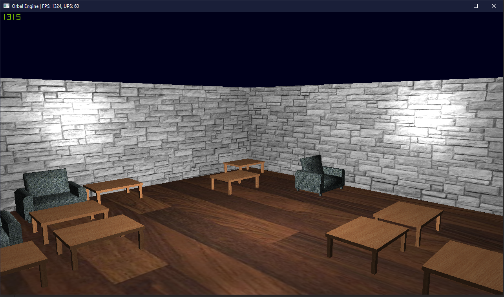

# OrbalEngine

Instalar pacote qt5-default para executar o arquivo binário ou compilar:
#sudo apt install qt5-default

Para rodar a cena corretamente pegar a cena.txt e passar como argumento na hora de executar o binário:
#./Orbal cena.txt

Para poder compilar necessário instalar o qt5.12.0 completo e abrir o arquivo orbal.pro com o qt creator:
http://download.qt.io/archive/qt/5.12/5.12.0/qt-opensource-linux-x64-5.12.0.run
http://download.qt.io/archive/qt/5.12/5.12.0/

Se não compilar tentar descomentar o que ta comentado no arquivo orbal.pro.
